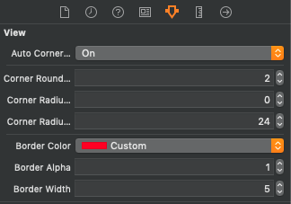

#  HKUIView #
     
#### Harrison Kong's Enhanced UIView ####


## VERSION HISTORY ##

1.0.0 - 2020/02/05 - Initial release

## MINIMUM REQUIREMENTS ##

**Swift** 4.0 or above

**iOS** 11.0 or above


## HOW TO INSTALL IT ##

Use one of the following methods:

### 1. Using CocoaPod ###

The module is avabilable via CocoaPods Trunk. Below is an example podfile. If you already use a podfile for your project, all you have to do is add the line that specifies `HKUIView`. The other dependencies will also be automatically installed in the xcworkspace.

```
platform :ios, '11.0'

target 'MyTarget' do

  use_frameworks!

  pod 'HKUIView', '~> 1.0.0'
  # other pods for your project

end

# This post_install section fixes a bug in CocoaPod that does not allow
# IBDesignables to render in interface builder

post_install do |installer|
installer.pods_project.targets.each do |target|
    target.new_shell_script_build_phase.shell_script = "mkdir -p $PODS_CONFIGURATION_BUILD_DIR/#{target.name}"
        target.build_configurations.each do |config|
            config.build_settings['CONFIGURATION_BUILD_DIR'] = '$PODS_CONFIGURATION_BUILD_DIR'
            config.build_settings.delete('CODE_SIGNING_ALLOWED')
            config.build_settings.delete('CODE_SIGNING_REQUIRED')
        end
    end
end
```

#### ***** IMPORTANT!! ***** ####

If you are installing this as a CocoaPod, you **MUST** include this script at the end of your Podfile or the Inspectables won't work in Interface Builder. However, if you don't, it will still function as expected at runtime. There is no need to include this if you do are not using Interface Builder.

```
# This post_install section fixes a bug in CocoaPod that does not allow
# IBDesignables to render in interface builder

post_install do |installer|
    installer.pods_project.targets.each do |target|
        target.new_shell_script_build_phase.shell_script = "mkdir -p $PODS_CONFIGURATION_BUILD_DIR/#{target.name}"
        target.build_configurations.each do |config|
            config.build_settings['CONFIGURATION_BUILD_DIR'] = '$PODS_CONFIGURATION_BUILD_DIR'
            config.build_settings.delete('CODE_SIGNING_ALLOWED')
            config.build_settings.delete('CODE_SIGNING_REQUIRED')
        end
    end
end
```

Don't forget to import the module in your source code:

```
import HKUIView
```

### 2. BY INCLUDING THE SOURCE FILES ###

You can also simply include the following source files in your project:

```
HKUIView.swift
UIView+HKAutoCornerRounding.swift
UIView+LengthCalculationBasis.swift
```


## WHAT IS IT? ##
`HKUIView` enhances the functionality of UIView by providing these additional features:

### Dynamic Corner Radius 
This class descends from UIView and provides the funcationalities to calculate a corner radius dynamically base on one of the sides. It uses the methods in HKUIViewAutoCornerExtension as a base.

### Border Customization
It also let users customize the border width, color and alpha value.

## HOW TO USE IT ##

### Interface Builder ###

1. Drop a UIView in your view controller then change the class in the *Identity Inspector* pane to HKUIView like this:


Note that you might need to wait for the design time code to compile after setting the class.

2. There will be 6 inspectable variables at the *Attribute Inspector* pane:



  - the first one **Auto Font Sizing** is an on/off switch to control whether automatic font sizing will be enabled.
  - the second attribute **Auto Font Size Basis** is an integer that corresponds to the following:

        1 = width of the label
        2 = height of the label
        3 = shorter edge (width or height) of the label
        4 = longer edge (width of height) of the label
        
        If this is set to any number less than 1, it will be assumed to be 1
        If this is set to any number greater than 4, it will be assumed to be 4
  
  - the third attribute is **Auto Size Font Factor** which is a decimal that is used to divide the chosen length in the previous attribute to be set as the font size. For example, if this is set to 2.0 and the previous attribute is 2 = height, the font size will be set to the height of the label divided by 2. Experiment to get the desired result.
  
3. Of course, the immediate appearance of the label might differ from the one at runtime if the label size changes.

### Programmatically ###

Create an instance of the class and then set the attributes (see Interface Builder above for explanations of the attributes)

```
let myView = HKUIView()
myView.autoSizeFont = true
myView.fontBasis = .height
myView.autoSizeFontFactor = 2.0
```

Note that the second attribute `fontBasis` is an enumeration type that is declared in `UIView+LengthCalculationBasis.swift` as follow:

```
@objc public enum LengthCalculationBasis: Int {
   case width = 1
   case height
   case shorterEdge
   case longerEdge
   case constant
}
```

However, `.constant` is not used or recognized by this class.


## KNOWN ISSUES ##

There are no known issues currently.

